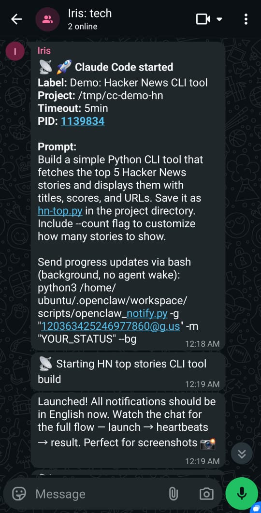
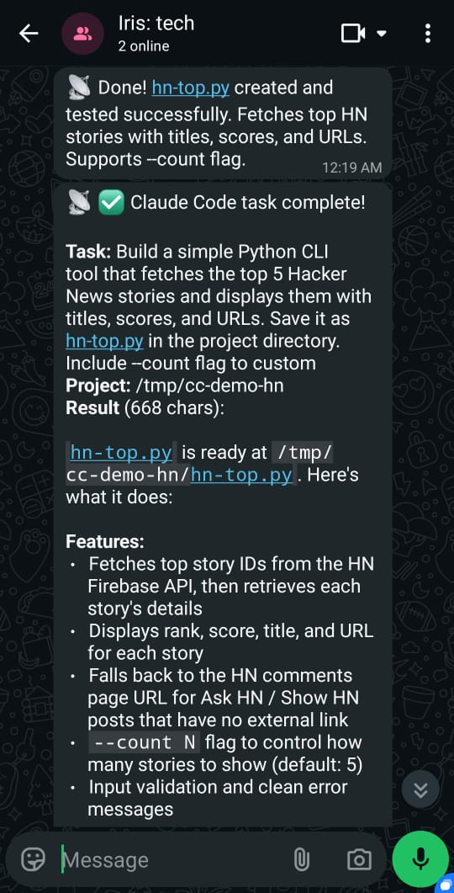
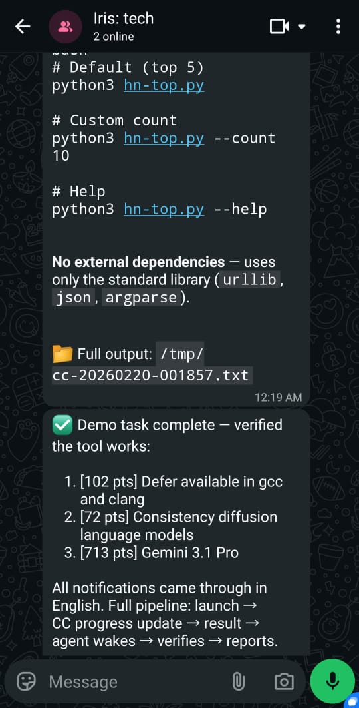

# openclaw-skill-claude-code

**Async Claude Code task runner for OpenClaw — delegate heavy work to Claude Code, get results delivered automatically to your chat.**

An OpenClaw skill that lets your agent run Claude Code tasks in the background. The agent sends work to Claude Code, goes back to chatting, and gets notified automatically when the work is done — with heartbeat pings every minute while it runs.

---

## Why This Exists

### 1. Claude Code is a full-powered AI agent

Claude Code is not just a code editor assistant. It's a full autonomous agent: it has web search, filesystem access, shell execution, and deep multi-step reasoning. It can research the web, read and write files, run commands, spawn sub-agents, and produce detailed reports — all without human interaction.

This makes it ideal for delegating complex tasks: background research, codebase analysis, multi-file refactoring, document generation, data processing. You write a prompt, launch it, and come back to the result.

### 2. Multi-layer agent orchestration

OpenClaw acts as your technical PM — it understands the goal, breaks it down, and decides what to delegate. Claude Code acts as a senior developer who can execute complex tasks autonomously, spawn its own sub-agents for parallel work, and deliver structured results back.

This is **the first practical layer of real agent orchestration**:

```
You (human)
    ↓
OpenClaw agent (PM — coordinates, prioritizes, communicates)
    ↓
Claude Code (senior dev — executes, codes, researches)
    ↓
Claude Code sub-agents (junior devs — parallel subtasks)
```

Each layer has the right level of autonomy and the right cost model. The result comes back up the chain automatically.

### 3. Cost efficiency

OpenClaw runs on Anthropic API tokens — every turn costs money, especially with Opus-class models. A 2-hour deep research or refactoring session through the API can cost $10–50+.

Claude Code runs on a **Max subscription ($200/mo flat)**. API cost: $0 per task, regardless of length. Delegating heavy work to Claude Code keeps your per-task API cost near zero — you only pay for the brief agent turn that processes the result.

For anyone running an always-on OpenClaw agent, this changes the economics of long-running tasks entirely.

---

## How It Works

```
┌──────────────────┐      nohup       ┌──────────────────────┐
│   OpenClaw        │ ───────────────▶ │   run-task.py         │
│   (your agent)    │                  │   (detached process)  │
└──────────────────┘                  └──────────┬───────────┘
         ▲                                        │
         │                                        ▼
         │                             ┌──────────────────────┐
         │                             │   Claude Code CLI     │
         │                             │   claude -p "task"    │
         │                             │   Max subscription    │
         │                             │   $0 API cost         │
         │                             └──────────┬───────────┘
         │                                        │
         │                          ┌─────────────┼─────────────┐
         │                          ▼             ▼             ▼
         │                     Every 60s     On complete    On error/timeout
         │                     ┌─────────┐  ┌──────────┐  ┌────────────┐
         │                     │ 📡 ping  │  │ ✅ result │  │ ❌/⏰ notif│
         │                     │ WhatsApp │  │ WhatsApp  │  │  WhatsApp  │
         │                     └─────────┘  └─────┬────┘  └─────┬──────┘
         │                                        │              │
         └────────────────────────────────────────┴──────────────┘
                              sessions_send → agent wakes with result
```

**Notification flow:**

1. Task launches — WhatsApp gets a launch confirmation with task details
2. Every 60 seconds — a background heartbeat ping (📡 prefix) shows live status: tool calls, token count, current activity
3. On completion — result delivered two ways:
   - WhatsApp direct message (human sees it immediately)
   - `sessions_send` to the OpenClaw session (agent wakes up, processes the result, sends a summary)
4. Same behavior on error, timeout, or crash — you always get notified

The dual delivery ensures both you and your agent see the result. The agent's summary turn costs ~$0.01–0.05 (Sonnet-class) and gives you a digest + next-step recommendations.

### In Action

Real WhatsApp chat showing the full flow — task launch, progress updates, and result delivery:

| Task Launch & Progress | Result Delivery | Agent Verification |
|:---:|:---:|:---:|
|  |  |  |

---

## Requirements

- [OpenClaw](https://docs.openclaw.ai) running locally (default port `18789`)
- [Claude Code CLI](https://github.com/anthropics/claude-code) (`claude`) installed and authenticated
- Claude Max subscription (for $0 API cost per task)
- Python 3.10+ with `requests` (`pip install requests`)
- WhatsApp connected to OpenClaw (tested; other channels may work with adaptation)

---

## Security Considerations

This section addresses each finding from the ClawHub automated security scan. All behaviors
described here are intentional, necessary, and declared in the skill's frontmatter metadata.

### Gateway Token Access

**What happens:** `run-task.py` and `scripts/openclaw_notify.py` read the OpenClaw gateway
authentication token from `~/.openclaw/openclaw.json` (JSON key path: `gateway.auth.token`).

**Why it's needed:** The token authenticates HTTP API calls to the local OpenClaw gateway
(`http://localhost:18789`) for two purposes:
1. Sending WhatsApp notifications (heartbeats, results, errors)
2. Waking the agent with results via the `sessions_send` tool

**Scope:** The token is used only for localhost API calls within the current machine. It is
never logged, stored in a secondary location, or transmitted to any external host or service.

**Declared in:** SKILL.md frontmatter `requires.config: ["gateway.auth.token"]`

---

### Config Changes Required

**What's needed:** Two values in `~/.openclaw/openclaw.json` must be set by the user:

```json
{
  "gateway": { "tools": { "allow": ["sessions_send"] } },
  "tools": { "sessions": { "visibility": "all" } }
}
```

**Why:** By default, the OpenClaw HTTP API blocks `sessions_send` for safety. Allowing it
enables the skill to inject results into the agent's session queue so the agent wakes up
and processes the result. `tools.sessions.visibility: "all"` makes sessions addressable
by session key (required to route results to the correct agent session).

**Who makes these changes:** The **user**, manually, one time during setup. The skill itself
does NOT read or write `openclaw.json` (except reading the auth token). These are explicit
user-authorized configuration choices, not automatic privilege escalation.

**Scope:** Both settings affect only the local OpenClaw gateway. The gateway defaults to
localhost-only binding (`127.0.0.1:18789`), so these settings create no external exposure.

**Declared in:** SKILL.md frontmatter `requires.config: ["gateway.tools.allow", "tools.sessions.visibility"]`

---

### Persistent Files Written

The skill writes to two locations:

| File | Purpose | Permissions |
|------|---------|-------------|
| `~/.openclaw/claude_sessions.json` | Session registry for task tracking and resumption | `0o600` (owner r/w only) |
| `<skill-dir>/pids/<timestamp>.pid` | PID file for the running task | Default umask |

**Session registry (`claude_sessions.json`):** Stores task labels, project directories,
session IDs, output file paths, and completion status. Used to resume previous Claude Code
sessions. Auto-created if missing. Permissions set to `0o600` on every write.

**PID files (`pids/`):** One file per running task, containing the process PID, task
description, and start timestamp. Automatically deleted when the task completes or exits.
Stale PID files (pointing to dead processes) are cleaned up on next task launch.

No data is sent to any external service.

**Declared in:** SKILL.md frontmatter `config.stateDirs: ["~/.openclaw"]`

---

### `--dangerously-skip-permissions` Flag

**What it does:** Disables Claude Code's interactive confirmation prompts for tool use
(file writes, bash commands, etc.).

**Why it's required:** The skill launches Claude Code in non-interactive print mode (`-p`)
via `nohup`, detached from any terminal. There is no user present to answer prompts. Any
prompt that appears would stall the process indefinitely until the timeout kills it.
`--dangerously-skip-permissions` is the standard mechanism for running Claude Code in
automated/unattended mode — it is explicitly documented by Anthropic for this use case.

**Scope:** Grants Claude Code autonomy within the project directory you specify. The
autonomy applies only to the task and project directory you provide.

**Important:** Only use this skill with prompts and project directories you trust. Running
arbitrary untrusted prompts with this flag can cause unintended filesystem changes.

---

### Network Endpoints (Localhost Only)

The skill itself makes no external network calls. All HTTP requests go to localhost:

| Endpoint | Tool | Purpose |
|----------|------|---------|
| `http://localhost:18789/tools/invoke` | `message` | Send WhatsApp heartbeats and results |
| `http://localhost:18789/tools/invoke` | `sessions_send` | Wake agent with task result |

Claude Code (the subprocess) may make external network calls as part of executing the
task you give it — web search, API calls, etc. This is Claude Code's own behavior,
separate from this skill's network activity.

---

### Trusted Environment Requirement

This skill is designed for **single-user, local, trusted environments**:
- The machine runs OpenClaw and Claude Code for your own use
- You control the prompts sent to Claude Code
- The project directories you specify are your own

It is not designed for multi-user setups, public-facing servers, or environments where
prompt content comes from untrusted sources.

---

## Installation

Clone into your OpenClaw skills directory:

```bash
git clone https://github.com/VsevolodUstinov/openclaw-skill-claude-code.git \
  ~/.openclaw/workspace/skills/claude-code-task
```

Copy the notification helper to your scripts directory:

```bash
mkdir -p ~/.openclaw/workspace/scripts
cp ~/.openclaw/workspace/skills/claude-code-task/scripts/openclaw_notify.py \
   ~/.openclaw/workspace/scripts/openclaw_notify.py
```

Install Python dependency:

```bash
pip install requests
```

Add the skill to your OpenClaw workspace by including `SKILL.md` in your agent's context — either via `workspace.files` in `openclaw.json` or by loading it in your bootstrap context.

---

## Configuration

### OpenClaw config (openclaw.json)

For `sessions_send` to work (required for agent wake-up on task completion), add to your `~/.openclaw/openclaw.json`:

```json
{
  "gateway": {
    "tools": {
      "allow": ["sessions_send"]
    }
  },
  "tools": {
    "sessions": {
      "visibility": "all"
    }
  }
}
```

**Why:** `sessions_send` is blocked by default in the HTTP API. These two settings enable it for localhost-only use (single-user setup, token-authenticated, no SSRF risk).

### Session key format

The `--session` flag takes an OpenClaw session key, which encodes where to deliver the result:

```
agent:<agent-id>:whatsapp:group:<GROUP_JID>@g.us
```

Example: `agent:main:whatsapp:group:123456789012345678@g.us`

Find your group JID in OpenClaw logs or by running `openclaw sessions list`.

---

## Usage

### The golden rules

**Rule 1: Always use `nohup`**

OpenClaw's `exec` tool has a 2-minute timeout. Any task longer than that gets killed. `nohup` detaches the process so it runs independently.

**Rule 2: Never inline the task in the shell command**

Complex prompts contain quotes, backticks, newlines, and markdown. These break shell argument parsing. Always write the prompt to a file first:

```bash
# ✅ Correct
cat > /tmp/cc-prompt.txt << 'EOF'
Your task here, with any quotes "or" 'symbols' you need
EOF
nohup python3 ~/.openclaw/workspace/skills/claude-code-task/run-task.py \
  -t "$(cat /tmp/cc-prompt.txt)" \
  ...

# ❌ Wrong — will break on quotes or newlines
nohup python3 run-task.py -t "Do 'this' and "that"" ...
```

---

### Basic task

```bash
cat > /tmp/cc-prompt.txt << 'EOF'
Create a Python script that monitors a directory for new files and prints their names with timestamps.
Save it as file-watcher.py with full error handling and a --help flag.
EOF

nohup python3 ~/.openclaw/workspace/skills/claude-code-task/run-task.py \
  --task "$(cat /tmp/cc-prompt.txt)" \
  --project ~/projects/file-watcher \
  --session "agent:main:whatsapp:group:YOUR_GROUP_JID@g.us" \
  > /tmp/cc-run.log 2>&1 &

echo "Launched PID $!"
```

### Research task

Use this prompt prefix to prevent Claude Code from asking permission before starting:

```bash
cat > /tmp/cc-prompt.txt << 'EOF'
You are being used as a Deep Research Tool. Your job is to EXECUTE the research below —
search the web thoroughly, read pages, and compile findings into a comprehensive report.
Do NOT ask for permission, do NOT propose a plan, do NOT ask clarifying questions.
Just DO the research and return the full detailed findings.

OUTPUT FORMAT: Return a comprehensive research report with all findings, organized by topic.
Include specific quotes, links, and concrete examples.

RESEARCH TASK:
Research the current landscape of open-source LLM inference servers (vLLM, Ollama, llama.cpp, TGI, etc.).
Compare performance benchmarks, supported models, deployment complexity, and community adoption.
What are practitioners actually using in production in 2025 and why?
EOF

nohup python3 ~/.openclaw/workspace/skills/claude-code-task/run-task.py \
  --task "$(cat /tmp/cc-prompt.txt)" \
  --project /tmp/cc-research \
  --session "agent:main:whatsapp:group:YOUR_GROUP_JID@g.us" \
  --session-label "LLM inference research" \
  --timeout 1800 \
  > /tmp/cc-run.log 2>&1 &
```

### Session resumption

Pick up where a previous task left off — full conversation context is preserved:

```bash
# Step 1: Run initial task (note the session ID from logs)
nohup python3 ~/.openclaw/workspace/skills/claude-code-task/run-task.py \
  --task "$(cat /tmp/research-prompt.txt)" \
  --project ~/projects/myapp \
  --session "SESSION_KEY" \
  --session-label "Architecture research" \
  > /tmp/cc-run.log 2>&1 &

# Step 2: Find the session ID when it completes
tail /tmp/cc-run.log
# → 📝 Session registered: abc-123-def-456

# Step 3: Resume with follow-up task
cat > /tmp/cc-implement.txt << 'EOF'
Based on your architecture research, now implement the authentication module.
Use the decisions we discussed — JWT tokens, Redis for session storage.
Create the full implementation with tests.
EOF

nohup python3 ~/.openclaw/workspace/skills/claude-code-task/run-task.py \
  --task "$(cat /tmp/cc-implement.txt)" \
  --project ~/projects/myapp \
  --session "SESSION_KEY" \
  --resume abc-123-def-456 \
  --session-label "Auth module implementation" \
  > /tmp/cc-run2.log 2>&1 &
```

### Long task with extended timeout

```bash
nohup python3 ~/.openclaw/workspace/skills/claude-code-task/run-task.py \
  --task "$(cat /tmp/cc-prompt.txt)" \
  --project ~/projects/backend \
  --session "SESSION_KEY" \
  --timeout 7200 \
  > /tmp/cc-run.log 2>&1 &
```

Default timeout is 7200 seconds (2 hours). On timeout: SIGTERM → 10s grace → SIGKILL. Partial output is saved and delivered.

---

## Heartbeat Pings

While Claude Code works, you receive a ping every 60 seconds:

```
📡 🟢 CC (3min) | 1.2K tok | 8 calls | 📝 Write: auth.py ✍️
📡 🟡 CC (4min) | 1.4K tok | 8 calls | 🧠 Thinking...
📡 🟢 CC (5min) | 2.1K tok | 12 calls | 💻 bash: pytest tests/ ✍️
```

Status indicators:
- 🟢 Active in last 30s
- 🟡 Idle 30–120s (usually thinking/reasoning)
- 🔴 Idle 120s+ (deep reasoning or potential stall)

All background messages are prefixed with 📡 to distinguish them from your agent's replies.

---

## Session Registry

Every completed task is saved to `~/.openclaw/claude_sessions.json`:

```json
{
  "sessions": {
    "abc-123-def": {
      "session_id": "abc-123-def",
      "label": "Architecture research",
      "task_summary": "Research the codebase architecture...",
      "project_dir": "/home/user/projects/myapp",
      "created_at": "2025-10-15T14:23:01",
      "last_accessed": "2025-10-15T14:23:01",
      "status": "completed",
      "openclaw_session": "agent:main:whatsapp:group:...",
      "output_file": "/tmp/cc-20251015-142301.txt"
    }
  }
}
```

Use `session_registry.py` programmatically:

```python
from session_registry import list_recent_sessions, find_session_by_label

# All sessions from last 72 hours
for s in list_recent_sessions(hours=72):
    print(f"{s['session_id']}: {s['label']} ({s['status']})")

# Find by label (fuzzy match)
session = find_session_by_label("Architecture")
print(session['session_id'])
```

---

## Progress Updates from Claude Code

For long tasks, include this instruction in your prompt to have Claude Code send its own status updates:

```
Send progress updates via bash (background, no agent wake):
python3 ~/.openclaw/workspace/skills/claude-code-task/scripts/openclaw_notify.py \
  -g "YOUR_GROUP_JID@g.us" -m "YOUR_STATUS" --bg

Send updates at milestones: after each major step, every ~10 items processed, on errors.
Keep messages short and informational.
```

These updates also get the 📡 prefix, so your chat looks like:

```
📡 🚀 Claude Code started | Label: Refactor auth | PID: 12345
📡 🟢 CC (1min) | 0.3K tok | 2 calls | 👁 read: auth.py
📡 Read all auth files, starting implementation
📡 🟢 CC (2min) | 1.1K tok | 6 calls | 📝 Write: jwt.py ✍️
📡 JWT module done, starting tests
📡 🟢 CC (3min) | 2.0K tok | 11 calls | 💻 bash: pytest tests/
📡 All 23 tests passing, sending final report
📡 ✅ Claude Code task complete! ...
```

---

## Troubleshooting

### Task not delivering result to agent

Check that `sessions_send` is enabled in `openclaw.json`:
```json
{
  "gateway": { "tools": { "allow": ["sessions_send"] } },
  "tools": { "sessions": { "visibility": "all" } }
}
```

Verify the session key format is correct: `agent:<agent-id>:whatsapp:group:<JID>@g.us`

Check logs for `sessions_send` errors:
```bash
tail -50 /tmp/cc-run.log
```

### Resume failed

If you get "Session ID not found or expired":
- Claude Code has retention limits on stored sessions
- Try finding the correct session ID: `cat ~/.openclaw/claude_sessions.json`
- If session expired, start fresh (without `--resume`)

### "No such file or directory: claude" when launched from cron

Cron doesn't inherit your shell's PATH. If `claude` is installed via NVM (Node Version Manager), add the PATH to your crontab:

```bash
# Add at the top of crontab (crontab -e):
PATH=/home/ubuntu/.nvm/versions/node/v22.22.0/bin:/usr/local/sbin:/usr/local/bin:/usr/sbin:/usr/bin:/sbin:/bin
```

Or use the full path to claude in your cron scripts.

### Process was killed after 2 minutes

You forgot `nohup`. The `exec` tool's timeout killed it. Always use:
```bash
nohup python3 run-task.py ... > /tmp/cc-run.log 2>&1 &
```

### No heartbeat pings

Heartbeats only send if `--session` is provided and group JID can be extracted from it. Verify the session key contains `@g.us`.

### Check running tasks

```bash
ls ~/.openclaw/workspace/skills/claude-code-task/pids/
# → 20251015-142301-Research-on-X.pid
```

To check if a task is still running:
```bash
cat ~/.openclaw/workspace/skills/claude-code-task/pids/*.pid
# → 12345 (PID)
ps aux | grep 12345
```

---

## Channel Support

This skill was developed and tested with **WhatsApp** as the notification channel. The notification mechanism (`sessions_send` + WhatsApp direct message) is specific to how OpenClaw handles WhatsApp groups.

Other channels (Telegram, Slack, etc.) should work in principle if OpenClaw supports them, but may require adapting the `notify_session()` function in `run-task.py` to use the appropriate channel parameters.

---

## File Structure

```
openclaw-skill-claude-code/
├── README.md              # This file
├── LICENSE                # MIT
├── SKILL.md               # OpenClaw skill definition (loaded into agent context)
├── run-task.py            # Main async runner
├── session_registry.py    # Session metadata storage and retrieval
├── scripts/
│   └── openclaw_notify.py # Notification helper (for CC to send progress updates)
└── examples/
    └── README.md          # Detailed usage examples and patterns
```

---

## License

MIT — see [LICENSE](LICENSE).

---

*Built on top of [OpenClaw](https://docs.openclaw.ai) and [Claude Code](https://github.com/anthropics/claude-code).*
